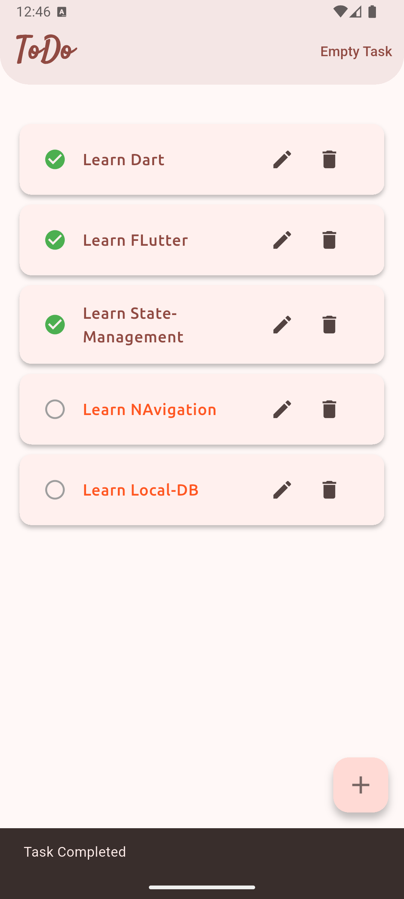
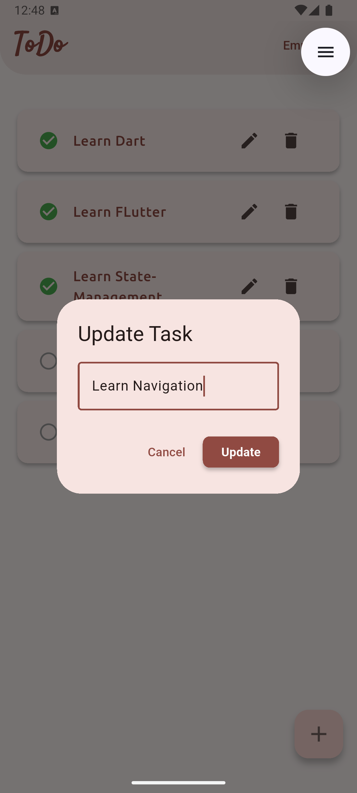
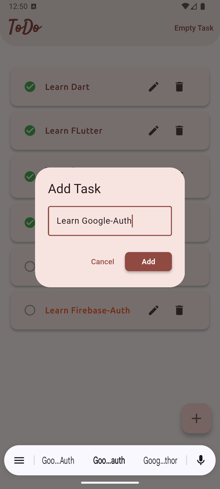
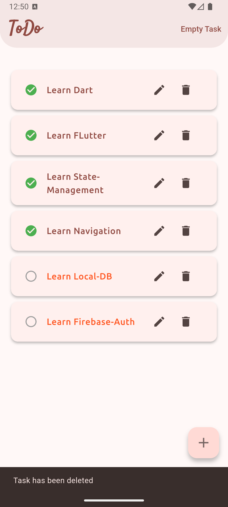
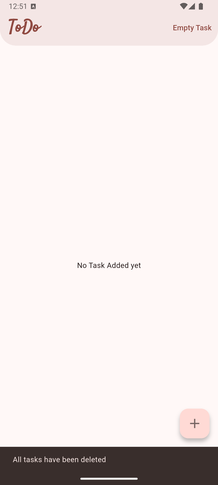

# 📌 learn_local_db
A simple and clean Flutter project demonstrating **Local Database CRUD** operations using **SQFlite**.

---

## 🚀 Features
- Add new task
- Update task status (complete/incomplete)
- Edit task content
- Delete single task
- Delete all tasks
- Beautiful UI with custom AppBar
- Local persistence using SQFlite
- Fully structured MVC-style architecture

---

## 🗄️ Tech Stack
- **Flutter**
- **SQFlite**
- **Path Provider**
- **Local SQLite Database**
- **Reusable Widgets**

---

## 📂 Project Structure  
```sh
lib/
├── models/
│ └── task.dart
├── services/
│ └── database_services.dart
├── screens/
│ └── home_page.dart
└── main.dart
```
---

## 🛠️ How It Works

### ✔ Create Task
Stores text + status (`0 = pending`, `1 = completed`)

### ✔ Read Tasks
Loads tasks from local SQLite database.

### ✔ Update Task
Toggle task status (completed / not completed)

### ✔ Delete Task / Delete All
Safely removes data from the database.

---

## 📸 Screenshots

<div align="center">
  
  
  
  
  
</div>

---


## Install Packages
```sh
flutter pub add path
flutter pub add sqflite
flutter pub add google_fonts
```